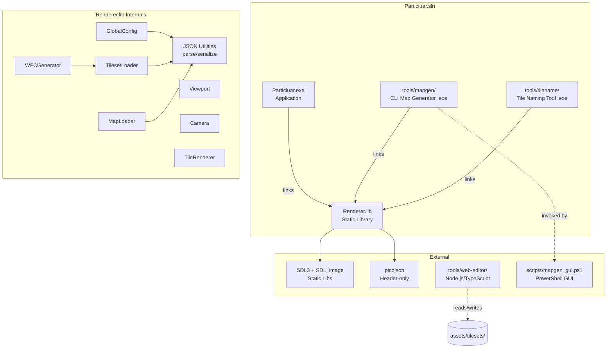
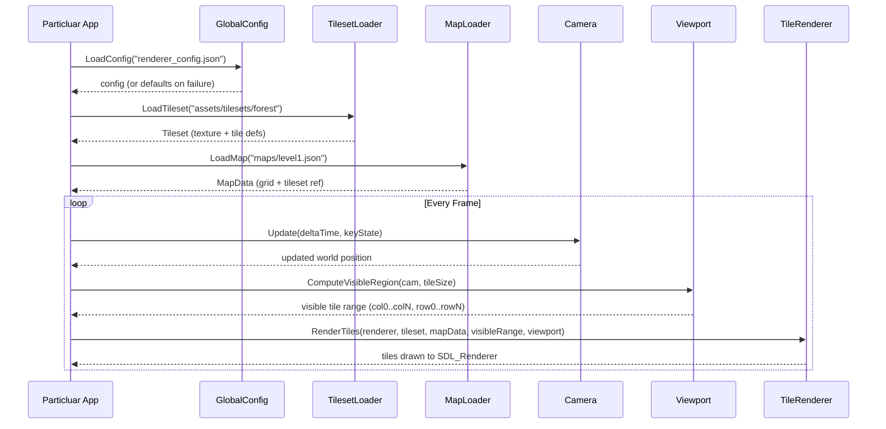
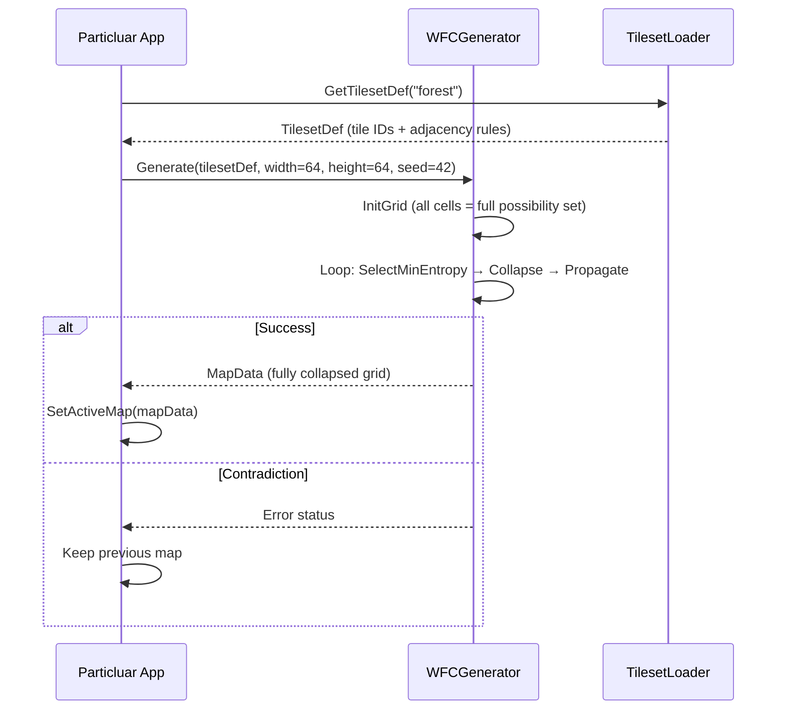
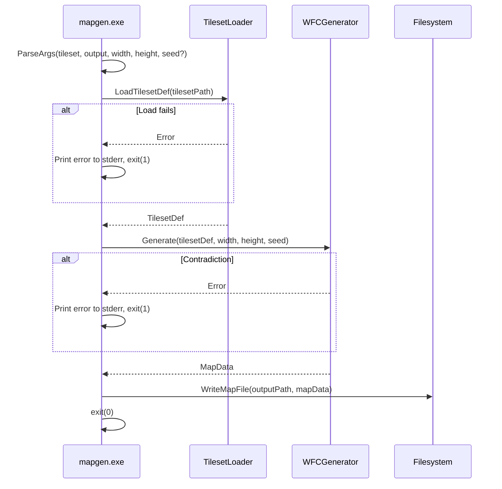

# Design Document: 2D Map System

## Overview

The 2D Map System is a modular tile-based rendering and generation framework for the Particluar project. It is implemented as a static library (`Renderer.lib`) within the existing `Particluar.sln`, providing viewport-based tile rendering with camera control, a Wave Function Collapse (WFC) procedural map generator, and a suite of companion tools (CLI map generator, tile naming tool, web-based editor).

The architecture strictly separates SDL-dependent rendering code from the pure-C++ generation algorithm. The Renderer library depends only on SDL3, SDL_image, and picojson — it has zero dependencies on Particluar application code, enabling reuse in future projects. The WFC generator is a pure-C++ module within the Renderer lib that has no SDL dependencies at all, allowing CLI tools to link against the Renderer for generation without pulling in graphics.

The system is data-driven: tile sizes, viewport defaults, and scroll speed are loaded from a Global Configuration JSON at startup, with robust fallback to hard-coded defaults on any error.

## Architecture



## Sequence Diagrams

### Initialization and Rendering Loop



### WFC Map Generation (Runtime)



### CLI Map Generation (Offline)



## Components and Interfaces

### Component 1: GlobalConfig

**Purpose**: Loads and validates the renderer's global configuration from a JSON file, providing data-driven defaults for tile size, viewport geometry, and scroll speed.

```cpp
struct GlobalConfigData {
    int tile_width;        // 1–512, default 32
    int tile_height;       // 1–512, default 32
    int viewport_x;        // 0–7680, default 0
    int viewport_y;        // 0–4320, default 0
    int viewport_width;    // 1–7680, default 800
    int viewport_height;   // 1–4320, default 600
    float scroll_speed;    // positive finite, default 200.0f
};

class GlobalConfig {
public:
    // Loads from file. Returns true if file parsed successfully.
    // On any failure, falls back to hard-coded defaults and logs via SDL_Log.
    bool Load(const std::string& filepath);

    // Returns current config (either loaded or defaults).
    const GlobalConfigData& Get() const;

    // Serializes current config back to JSON string (round-trip safe).
    std::string Serialize() const;

private:
    GlobalConfigData m_data;
    void ApplyDefaults();
    bool Validate(const GlobalConfigData& candidate) const;
};
```

**Responsibilities**:
- Parse renderer_config.json via picojson
- Validate all fields against specified ranges
- Fall back to hard-coded defaults on any error (missing file, parse error, invalid values)
- Log warnings via SDL_Log indicating fallback reason
- Support round-trip serialization

### Component 2: Viewport

**Purpose**: Defines the screen-space rectangular region where map content is drawn, with clipping, alpha transparency, and Z-depth layer support.

```cpp
struct ViewportRect {
    int x;       // screen-space left edge (pixels)
    int y;       // screen-space top edge (pixels)
    int width;   // viewport width (pixels)
    int height;  // viewport height (pixels)
};

struct VisibleTileRange {
    int col_start;  // first visible column (inclusive)
    int col_end;    // last visible column (inclusive)
    int row_start;  // first visible row (inclusive)
    int row_end;    // last visible row (inclusive)
};

class Viewport {
public:
    void SetRect(const ViewportRect& rect);
    const ViewportRect& GetRect() const;

    // Returns true if viewport has positive dimensions (renderable).
    bool IsValid() const;

    // Computes which tiles are potentially visible given camera and tile size.
    VisibleTileRange ComputeVisibleTiles(
        float camera_x, float camera_y,
        float pivot_x, float pivot_y,
        int tile_width, int tile_height) const;

    // Sets SDL clip rect for rendering. Call before drawing tiles.
    void ApplyClip(SDL_Renderer* renderer) const;

    // Removes SDL clip rect. Call after drawing tiles.
    void RemoveClip(SDL_Renderer* renderer) const;

private:
    ViewportRect m_rect;
};
```

**Responsibilities**:
- Define the renderable screen region
- Compute visible tile ranges from camera position + pivot
- Apply/remove SDL clip rectangles to enforce viewport boundaries
- Reject rendering when width or height <= 0

### Component 3: Camera

**Purpose**: Maintains the world-space position and center pivot for determining which portion of the map is visible.

```cpp
class Camera {
public:
    Camera();

    void SetPosition(float x, float y);
    float GetX() const;
    float GetY() const;

    // Pivot: normalized 0.0–1.0 per axis, clamped. Default (0.5, 0.5).
    void SetPivot(float px, float py);
    float GetPivotX() const;
    float GetPivotY() const;

    // Moves camera based on held WASD keys. deltaTime in seconds.
    void Update(float deltaTime, float scrollSpeed, const bool* keyState);

private:
    float m_x, m_y;
    float m_pivot_x, m_pivot_y;
};
```

**Responsibilities**:
- Store and expose world-space camera position (float)
- Store and clamp center pivot (0.0–1.0)
- Translate WASD key states into camera movement scaled by delta time and scroll speed
- Support simultaneous key presses for diagonal movement

### Component 4: TilesetLoader

**Purpose**: Loads tileset assets (PNG spritesheet + JSON sidecar) from disk into memory, producing a validated in-memory tileset definition.

```cpp
struct SourceRect {
    int x, y, w, h;  // w >= 1, h >= 1
};

struct AdjacencyRules {
    std::vector<std::string> up;
    std::vector<std::string> down;
    std::vector<std::string> left;
    std::vector<std::string> right;
};

struct TileDef {
    std::string id;            // unique within tileset, 1–64 chars
    SourceRect source_rect;
    AdjacencyRules adjacency;
};

struct Tileset {
    std::string name;                      // tileset folder name
    SDL_Texture* texture;                  // loaded spritesheet (owned)
    int texture_width, texture_height;     // spritesheet pixel dimensions
    std::vector<TileDef> tiles;            // validated tile definitions
    std::map<std::string, size_t> id_index; // id → index in tiles vector
};

// Pure data version (no SDL_Texture) for CLI tools and WFC generator
struct TilesetDef {
    std::string name;
    int texture_width, texture_height;
    std::vector<TileDef> tiles;
    std::map<std::string, size_t> id_index;
};

class TilesetLoader {
public:
    // Full load with texture (requires SDL_Renderer). For runtime rendering.
    bool LoadTileset(SDL_Renderer* renderer, const std::string& folderPath, Tileset& out);

    // Data-only load (no texture). For CLI tools and WFC.
    bool LoadTilesetDef(const std::string& folderPath, TilesetDef& out);

private:
    bool ParseSidecarJson(const std::string& jsonPath, int texW, int texH,
                          std::vector<TileDef>& outTiles);
};
```

**Responsibilities**:
- Load PNG via IMG_LoadTexture (runtime) or skip texture (CLI)
- Parse sidecar JSON via picojson
- Validate Source_Rects against PNG dimensions
- Skip and log tiles with invalid/missing data
- Build id→index lookup map
- Enforce folder naming constraints (1–64 chars, a-z/0-9/underscore)

### Component 5: MapLoader

**Purpose**: Loads and saves Map_File JSON, resolving tile IDs against a loaded tileset.

```cpp
struct MapData {
    int width;                              // 1–4096
    int height;                             // 1–4096
    std::string tileset_id;                 // 1–255 chars
    std::vector<std::vector<std::string>> grid; // row-major, grid[row][col] = tile ID
};

class MapLoader {
public:
    // Parse a map file from disk.
    bool LoadMap(const std::string& filepath, MapData& out);

    // Serialize a MapData to JSON string (2-space pretty-print).
    std::string SerializeMap(const MapData& mapData) const;

    // Write map to disk.
    bool SaveMap(const std::string& filepath, const MapData& mapData);

    // Validate tile IDs in grid against tileset. Returns list of unresolved IDs+positions.
    struct UnresolvedTile { std::string id; int row; int col; };
    std::vector<UnresolvedTile> ValidateAgainstTileset(
        const MapData& mapData, const TilesetDef& tileset) const;
};
```

**Responsibilities**:
- Parse Map_File JSON (grid dimensions, tileset ref, 2D tile ID array)
- Validate dimensional consistency (row count == height, all rows == width)
- Serialize with 2-space indentation via picojson::serialize(true)
- Guarantee round-trip: parse → serialize → parse yields identical data
- Report unresolved tile IDs for fallback rendering

### Component 6: TileRenderer

**Purpose**: Draws visible tiles to the SDL_Renderer within the viewport, handling alpha, layers, and fallback tiles.

```cpp
class TileRenderer {
public:
    // Render all visible tiles for a single layer.
    void RenderLayer(
        SDL_Renderer* renderer,
        const Tileset& tileset,
        const MapData& mapData,
        const VisibleTileRange& range,
        const Viewport& viewport,
        const Camera& camera,
        int layer,           // Z-depth layer index
        Uint8 alpha          // 0–255 transparency
    );

    // Set the fallback tile color for unresolved tile IDs.
    void SetFallbackColor(Uint8 r, Uint8 g, Uint8 b);

private:
    Uint8 m_fallback_r = 255, m_fallback_g = 0, m_fallback_b = 255; // magenta
};
```

**Responsibilities**:
- Draw tiles in ascending layer order
- Skip tiles entirely outside the viewport (frustum cull)
- Clip tiles partially overlapping viewport edges via SDL clip rect
- Apply per-tile alpha modulation
- Render a visually distinct fallback (magenta) for unresolved tile IDs
- Render nothing when viewport is invalid (width or height <= 0)

### Component 7: WFCGenerator

**Purpose**: Implements the Wave Function Collapse algorithm in pure C++ with zero SDL dependencies.

```cpp
enum class WFCStatus {
    Success,
    Contradiction,
    InvalidInput
};

struct WFCParams {
    int width;                  // 1–1024
    int height;                 // 1–1024
    unsigned int seed;          // 0 = non-deterministic
    const TilesetDef* tileset;  // must not be null
};

struct WFCResult {
    WFCStatus status;
    MapData map;                // valid only if status == Success
};

class WFCGenerator {
public:
    WFCResult Generate(const WFCParams& params);

private:
    struct Cell {
        std::vector<bool> possibilities; // one bit per tile in tileset
        int entropy;                      // count of remaining possibilities
        bool collapsed;
    };

    // Select cell with minimum entropy (excluding already-collapsed).
    // Returns {row, col} or {-1,-1} if all collapsed.
    std::pair<int,int> SelectMinEntropy(
        const std::vector<std::vector<Cell>>& grid) const;

    // Collapse a cell to one tile, using RNG.
    void Collapse(Cell& cell, std::mt19937& rng);

    // Propagate constraints from a collapsed cell outward.
    // Returns false if a contradiction is found (any cell has 0 possibilities).
    bool Propagate(std::vector<std::vector<Cell>>& grid,
                   int startRow, int startCol,
                   const TilesetDef& tileset);
};
```

**Responsibilities**:
- Accept tileset definition and grid dimensions as input
- Validate inputs (0 tiles → error, dimensions outside 1–1024 → error)
- Initialize grid with all tiles as possibilities
- Select minimum-entropy cell for collapse
- Collapse chosen cell using seeded PRNG (std::mt19937)
- Propagate adjacency constraints to neighbors
- Detect and report contradictions without corrupting output
- Same seed + same input → identical output (deterministic)
- No SDL dependencies (operates on TilesetDef, not Tileset)

### Component 8: JSON Utilities

**Purpose**: Shared parsing and serialization helpers wrapping picojson, used across all components.

```cpp
namespace JsonUtil {
    // Parse a JSON file from disk. Returns false and logs on error.
    bool ParseFile(const std::string& filepath, picojson::value& outRoot);

    // Parse a JSON string. Returns false and logs on error.
    bool ParseString(const std::string& jsonStr, picojson::value& outRoot);

    // Serialize a picojson value to pretty-printed JSON (2-space indent).
    std::string Serialize(const picojson::value& val);

    // Write JSON string to file. Returns false on I/O error.
    bool WriteFile(const std::string& filepath, const std::string& json);

    // Safe field extraction helpers
    bool GetInt(const picojson::object& obj, const std::string& key, int& out);
    bool GetDouble(const picojson::object& obj, const std::string& key, double& out);
    bool GetString(const picojson::object& obj, const std::string& key, std::string& out);
    bool GetBool(const picojson::object& obj, const std::string& key, bool& out);
    bool GetArray(const picojson::object& obj, const std::string& key, const picojson::array*& out);
    bool GetObject(const picojson::object& obj, const std::string& key, const picojson::object*& out);
}
```

**Responsibilities**:
- Centralize all picojson interactions
- Provide safe type-checked field extraction (always is<T> before get<T>)
- Handle file I/O (read entire file, write with proper error reporting)
- Preserve unknown fields during round-trip (store full picojson::value)
- Use serialize(true) for 2-space pretty-printing

## Data Models

### Model 1: Global Config JSON

```json
{
  "tile_width": 32,
  "tile_height": 32,
  "viewport_x": 0,
  "viewport_y": 0,
  "viewport_width": 800,
  "viewport_height": 600,
  "scroll_speed": 200.0
}
```

**Validation Rules**:
- `tile_width`: integer, 1–512
- `tile_height`: integer, 1–512
- `viewport_x`: integer, 0–7680
- `viewport_y`: integer, 0–4320
- `viewport_width`: integer, 1–7680
- `viewport_height`: integer, 1–4320
- `scroll_speed`: number, positive finite
- Any single field failure → entire file rejected, all defaults used

### Model 2: Sidecar JSON (Tileset Metadata)

```json
{
  "tiles": [
    {
      "id": "grass_01",
      "source_rect": { "x": 0, "y": 0, "w": 32, "h": 32 },
      "adjacency": {
        "up": ["grass_01", "grass_02"],
        "down": ["grass_01", "dirt_01"],
        "left": ["grass_02"],
        "right": ["grass_01", "water_edge"]
      }
    },
    {
      "id": "grass_02",
      "source_rect": { "x": 32, "y": 0, "w": 32, "h": 32 },
      "adjacency": {
        "up": ["grass_01"],
        "down": ["grass_02", "dirt_01"],
        "left": ["grass_01"],
        "right": ["grass_02"]
      }
    }
  ]
}
```

**Validation Rules**:
- Root must be an object with a "tiles" array
- Each tile entry requires: `id` (string 1–64 chars, unique), `source_rect` (object with x,y,w,h), `adjacency` (object with up/down/left/right arrays)
- `source_rect.w` >= 1, `source_rect.h` >= 1
- `source_rect` region must fit within PNG dimensions
- Unknown fields at any level are preserved during round-trip

### Model 3: Map File JSON

```json
{
  "width": 64,
  "height": 64,
  "tileset": "forest",
  "grid": [
    ["grass_01", "grass_02", "dirt_01", "..."],
    ["grass_01", "water_edge", "water_01", "..."]
  ]
}
```

**Validation Rules**:
- `width`: integer, 1–4096
- `height`: integer, 1–4096
- `tileset`: string, 1–255 characters
- `grid`: array of arrays (row-major), grid.length == height, each row.length == width
- Each cell: string (tile ID), 1–128 characters
- Unknown fields are preserved during round-trip
- Dimension mismatch → reject entire file

## Error Handling

### Error Scenario 1: Missing/Invalid Global Config

**Condition**: Config file not found, fails JSON parsing, has missing keys, or values out of range.
**Response**: All settings fall back to hard-coded defaults. SDL_Log warning with specific reason.
**Recovery**: System operates normally with defaults. No user-visible error.

### Error Scenario 2: Tileset Load Failure

**Condition**: PNG fails to load (IMG_LoadTexture returns NULL) or sidecar JSON fails to parse.
**Response**: LoadTileset returns false. Logs file path and error string.
**Recovery**: Caller decides whether to abort or try a different tileset. System does not crash.

### Error Scenario 3: Individual Tile Entry Invalid

**Condition**: A tile entry in sidecar JSON has missing field, invalid type, or source_rect out of bounds.
**Response**: That entry is skipped. Warning logged identifying the tile (by index or id). Remaining tiles load normally.
**Recovery**: Tileset is usable with fewer tiles. WFC may have reduced generation options.

### Error Scenario 4: WFC Contradiction

**Condition**: During generation, a cell reaches zero valid possibilities.
**Response**: WFCGenerator returns WFCStatus::Contradiction. Output MapData is empty/invalid.
**Recovery**: Runtime keeps previous map. CLI exits with non-zero code and stderr message.

### Error Scenario 5: Map File Invalid

**Condition**: Map JSON malformed, dimension mismatch, or tileset not found.
**Response**: LoadMap returns false with logged error. Unresolved tile IDs render as magenta fallback.
**Recovery**: If tileset missing entirely, map is not rendered. If individual tile IDs are unresolved, those cells show fallback.

### Error Scenario 6: WFC Invalid Input

**Condition**: Zero tiles in tileset, or grid dimensions outside 1–1024.
**Response**: WFCGenerator returns WFCStatus::InvalidInput immediately.
**Recovery**: Caller receives error status without any generation attempt.

## Testing Strategy

### Unit Testing Approach

- **GlobalConfig**: Test parsing valid JSON, missing keys, out-of-range values, malformed JSON, missing file. Verify defaults applied correctly in each failure case.
- **Viewport**: Test ComputeVisibleTiles with various camera positions, pivots, and edge cases (camera at world origin, camera far off-map).
- **Camera**: Test WASD movement with various delta times, verify diagonal movement magnitude, verify pivot clamping.
- **TilesetLoader**: Test with valid sidecar JSON, missing fields, source_rects out of bounds, duplicate IDs.
- **MapLoader**: Test round-trip (parse → serialize → parse), dimension mismatch rejection, empty grid.
- **WFCGenerator**: Test deterministic output with fixed seed, contradiction detection, invalid input rejection, small grid (1x1, 2x2) correctness.
- **JSON Utilities**: Test safe extraction helpers with wrong types, missing keys, null values.

### Property-Based Testing Approach

**Property Test Library**: A lightweight custom C++ property-testing harness generating random inputs.

Key properties:
- **Round-trip**: For any valid GlobalConfig/Sidecar/MapFile, parse(serialize(parse(input))) == parse(input).
- **WFC Adjacency Correctness**: For any successful WFC output, every adjacent cell pair respects the tileset's adjacency rules.
- **WFC Determinism**: generate(seed, tileset, w, h) == generate(seed, tileset, w, h) across multiple runs.
- **Viewport Visible Range**: All tiles in the computed visible range intersect the viewport rectangle; no tiles outside the range intersect it.

### Integration Testing Approach

- **Renderer + App PoC**: WASD scrolling over a small test map verifies camera, viewport, and tile rendering work together.
- **CLI → Runtime**: Generate a map with CLI tool, load it in runtime, verify all tiles resolve.
- **Web Editor → Runtime**: Export a map from web editor, load in runtime, verify grid integrity.

## Performance Considerations

- **Frustum Culling**: Only tiles within the computed visible range are submitted to SDL_RenderCopy. For a 64x64 map with 32px tiles in an 800x600 viewport, at most ~475 tiles are drawn per frame (25×19) vs. 4096 total.
- **WFC Performance Target**: 64×64 grid must complete within 5 seconds on a 2 GHz x64 CPU with 4 GB RAM. The min-entropy heuristic keeps the algorithm from worst-case exponential blowup on well-constrained tilesets.
- **Texture Atlas**: Each tileset is a single SDL_Texture (one spritesheet). No per-tile texture swaps — only source_rect changes per SDL_RenderCopy call.
- **Lazy Visible Range**: The visible tile range is recomputed only when the camera moves or viewport changes, not every frame unconditionally.

## Security Considerations

- **JSON Parsing Robustness**: All JSON inputs (config, sidecar, map files) are validated before use. picojson's depth limit (default 100) prevents stack overflow from deeply nested malicious files.
- **File Path Validation**: Tileset folder names are constrained to `[a-z0-9_]{1,64}` preventing path traversal attacks.
- **Integer Overflow**: Grid dimensions capped at 4096×4096 (max 16M cells). Each cell is a string ID (not raw data), keeping memory bounded. WFC grid capped at 1024×1024.
- **SDL_Texture Limits**: Spritesheet dimensions validated after loading; source_rects checked against actual texture size.

## Dependencies

| Dependency | Type | Used By | Purpose |
|---|---|---|---|
| SDL3 (static) | Library | Renderer lib, App | Window, Renderer, Input, Logging |
| SDL_image (static) | Library | Renderer lib (TilesetLoader) | PNG spritesheet loading |
| picojson (header-only) | Header | Renderer lib (all JSON ops) | JSON parsing and serialization |
| std::mt19937 | C++ stdlib | WFCGenerator | Deterministic PRNG for WFC |
| Node.js + TypeScript | Runtime | Web Editor (tools/web-editor/) | Browser-based tileset configurator and level editor |
| PowerShell | Script | scripts/mapgen_gui.ps1 | Optional Windows GUI wrapper for CLI tool |

## Project Structure

```
Particluar/
├── Particluar.sln
├── Particluar.vcxproj              (Application - links Renderer.lib)
├── renderer/
│   ├── Renderer.vcxproj            (Static Library)
│   ├── include/
│   │   ├── GlobalConfig.h
│   │   ├── Viewport.h
│   │   ├── Camera.h
│   │   ├── TilesetLoader.h
│   │   ├── MapLoader.h
│   │   ├── TileRenderer.h
│   │   ├── WFCGenerator.h
│   │   └── JsonUtil.h
│   └── src/
│       ├── GlobalConfig.cpp
│       ├── Viewport.cpp
│       ├── Camera.cpp
│       ├── TilesetLoader.cpp
│       ├── MapLoader.cpp
│       ├── TileRenderer.cpp
│       ├── WFCGenerator.cpp
│       └── JsonUtil.cpp
├── tools/
│   ├── mapgen/
│   │   ├── mapgen.vcxproj          (Console .exe - links Renderer.lib)
│   │   └── main.cpp
│   ├── tilename/
│   │   ├── tilename.vcxproj        (Console .exe - links Renderer.lib)
│   │   └── main.cpp
│   └── web-editor/
│       ├── package.json
│       ├── tsconfig.json
│       └── src/
├── scripts/
│   └── mapgen_gui.ps1
├── assets/
│   └── tilesets/
│       └── <name>/
│           ├── <name>.png
│           └── <name>.json
├── include/
│   └── App.h
├── src/
│   └── main.cpp
└── vendor/
    ├── SDL/
    ├── SDL_image/
    ├── picojson/
    └── stb/
```
