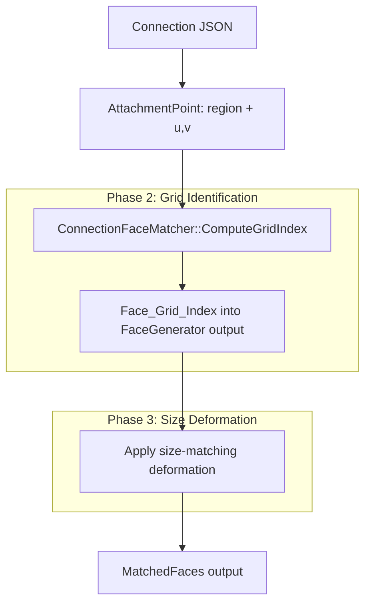

# Design Document: Connection System V3 (Phases 2–3)

## Overview

This design covers Phases 2 and 3 of the Connection System V3 rewrite — grid-based face identification and size-matching deformation. Phase 1 (rendering unmodified closed solids with correct parametric positioning) is already complete and committed.

The core problem: given a parametric attachment point (region + u,v coordinates), we need to deterministically identify which face in a shape's generated face array corresponds to that connection point, then uniformly scale that face to a midpoint radius so both parent and child shapes share a matching connection face size.

**Design Rationale:** Rather than using world-space proximity searches (the current Phase 1 approach with O(n) distance comparisons), we compute face indices algebraically from UV parameters. This is O(1), deterministic, and independent of floating-point position drift.

## Architecture



The data flow remains unchanged from Phase 1. `GenerateWithConnections` still receives a `BodyNode` and `ConnectionRing` vector. The difference is that face identification switches from proximity search to grid-index computation, and the identified face's vertices are then scaled.

## Components and Interfaces

### Modified: `ConnectionFaceMatcher`

The existing class (~130 lines) gains two new internal methods and a rewritten `GenerateWithConnections`:

```cpp
// NEW: Compute the face index in FaceGenerator output for a given shape+attachment
int ComputeGridIndex(const ShapeParams& shape, const AttachmentPoint& attach) const;

// NEW: Apply uniform scale from face center to reach target radius
void DeformFaceToRadius(
    std::vector<Face>& faces,
    int face_index,
    float target_radius
) const;
```

The existing `TaperCylinderEnd`, `TaperSphereRegion`, `TaperCapsuleRegion`, `TaperTorusRegion` methods declared in the header are **removed** — they were forward declarations for a tapering approach that is now replaced by uniform-scale deformation. The replacement is a single `DeformFaceToRadius` that works identically for all shapes.

### Unchanged: `FaceGenerator`

No modifications. The face ordering produced by `FaceGenerator::Generate()` is the contract that `ComputeGridIndex` must match.

### Unchanged: `ConnectionSolver`

No modifications. Positioning remains parametric via `ComputeParametricTransform`.

### New: Topological Compatibility Validation

Added to body loading (`BodyLoader` or equivalent):

```cpp
enum class FacePolygonType { Ngon, Quad, Triangle };

FacePolygonType GetPolygonTypeAtAttachment(const ShapeParams& shape, const AttachmentPoint& attach);
bool ValidateConnectionCompatibility(const Connection& conn, const ShapeParams& parent, const ShapeParams& child);
```

## Data Models

### Face Grid Layout by Primitive Type

#### Cylinder (segments=N, height_segments=H)

FaceGenerator output order:
1. Lateral quads: `N*H` faces, stored row-major (row 0 = bottom row)
   - Index = `row * N + col` where row ∈ [0, H-1], col ∈ [0, N-1]
2. Top cap: 1 N-gon face at index `N*H`
3. Bottom cap: 1 N-gon face at index `N*H + 1`

**Total faces:** `N*H + 2`

Grid index computation from AttachmentPoint:
- `region == Top` → index `N*H` (the top cap)
- `region == Bottom` → index `N*H + 1` (the bottom cap)
- `region == Side` → `col = clamp(floor(u * N), 0, N-1)`, `row = clamp(floor(v * H), 0, H-1)`, index = `row * N + col`

Note: FaceGenerator emits lateral quads first (iterating `row` then `col` within each row), then top cap, then bottom cap.

#### Cone (segments=N)

FaceGenerator output order:
1. Lateral triangles: N faces (triangle fan from tip)
   - Index = col, where col ∈ [0, N-1]
2. Base cap: 1 N-gon face at index N

**Total faces:** `N + 1`

Grid index computation:
- `region == Base` → index `N`
- `region == Side` → `col = clamp(floor(u * N), 0, N-1)`, index = col

#### Torus (ring_segments=R, side_segments=T)

FaceGenerator output order:
- All quads in ring-major order: ring i, side j → index `i * T + j`
- Where i ∈ [0, R-1], j ∈ [0, T-1]

**Total faces:** `R * T`

Grid index computation:
- `col = clamp(floor(u * R), 0, R-1)`, `row = clamp(floor(v * T), 0, T-1)`
- index = `col * T + row`

#### Sphere (lon_segments=S, lat_segments=T)

FaceGenerator output order:
1. North pole triangles: S faces (indices 0..S-1)
2. Mid-band quads: `S * (T-2)` faces, stored stack-major
   - Stack i (1-indexed from top), slice j → index `S + (i-1)*S + j`
   - Where i ∈ [1, T-2], j ∈ [0, S-1]
3. South pole triangles: S faces at the end

**Total faces:** `S + S*(T-2) + S = S*T`

Grid index computation (using `region == Surface`, u=longitude, v=latitude 0=top 1=bottom):
- `col = clamp(floor(u * S), 0, S-1)`
- `stack_f = v * T` (continuous stack position, 0 to T)
- If `stack_f < 1.0` → north pole triangle, index = col
- If `stack_f >= T-1` → south pole triangle, index = `S + S*(T-2) + col`
- Else → mid-band quad: `row = clamp(floor(stack_f) - 1, 0, T-3)`, index = `S + row*S + col`

#### Capsule (segments=N, height_segments=H, hemi_stacks = N/2)

FaceGenerator output order:
1. Top pole triangles: N faces
2. Top hemisphere quads: `N * (hemi_stacks - 1)` faces
3. Cylinder lateral quads: `N * H` faces (if cylinder_height > 0)
4. Bottom hemisphere quads: `N * (hemi_stacks - 1)` faces
5. Bottom pole triangles: N faces

Grid index computation:
- `region == TopCap/Top`:
  - If v maps to pole → top pole triangle by col
  - Else → top hemisphere quad by (stack, col)
- `region == Side` → cylinder section: `row * N + col` offset by top hemisphere count
- `region == BottomCap/Bottom`:
  - If v maps to pole → bottom pole triangle by col
  - Else → bottom hemisphere quad by (stack, col)

### Face Polygon Types by Attachment

| Shape | Region | Polygon Type |
|-------|--------|-------------|
| Cylinder | Top | N-gon |
| Cylinder | Bottom | N-gon |
| Cylinder | Side | Quad |
| Cone | Base | N-gon |
| Cone | Side | Triangle |
| Sphere | Surface (pole) | Triangle |
| Sphere | Surface (mid-band) | Quad |
| Torus | Surface | Quad |
| Capsule | TopCap (pole) | Triangle |
| Capsule | TopCap (non-pole) | Quad |
| Capsule | Side | Quad |
| Capsule | BottomCap (pole) | Triangle |
| Capsule | BottomCap (non-pole) | Quad |

### Size-Matching Deformation Algorithm

Given a connection face at `face_index` with target `midpoint_radius`:

```
1. Compute face_center = average of all vertices of faces[face_index]
2. Compute current_radius = average distance from face_center to each vertex
3. If |current_radius - midpoint_radius| < epsilon: no-op (already matching)
4. scale_factor = midpoint_radius / current_radius
5. For each vertex V in faces[face_index]:
     V_new = face_center + (V - face_center) * scale_factor
6. For each neighboring face that shares an edge vertex with faces[face_index]:
     Update shared vertices to match new positions (propagation)
     Leave non-shared vertices unchanged
```

**Shared vertex propagation:** After scaling the connection face, any adjacent face that shares one or more vertices with the scaled face must have those shared vertices updated to the new positions. This maintains mesh continuity without affecting the rest of the shape.

Vertex sharing is detected by position equality (within epsilon tolerance of 1e-5f). This works because FaceGenerator produces faces with geometrically coincident vertices at shared edges.

**Key constraint:** Only vertices that are geometrically coincident with a modified vertex are updated. The deformation is strictly local — at most 1 ring of adjacent faces is affected.

### Topological Compatibility Rules

Valid connections (same polygon type on both sides):
- **Quad ↔ Quad:** cylinder side, torus surface, sphere mid-band, capsule side/hemisphere
- **N-gon ↔ N-gon:** cylinder top, cylinder bottom, cone base
- **Tri ↔ Tri:** cone side, sphere pole, capsule pole

Invalid connections (rejected at load time):
- Quad ↔ N-gon, Quad ↔ Triangle, N-gon ↔ Triangle

## Correctness Properties

*A property is a characteristic or behavior that should hold true across all valid executions of a system — essentially, a formal statement about what the system should do. Properties serve as the bridge between human-readable specifications and machine-verifiable correctness guarantees.*


### Property 1: Grid Index Correctness

*For any* valid shape (Cylinder, Cone, Torus, Sphere, Capsule) with any valid segment parameters, and *for any* attachment point with UV coordinates in [0, 1), `ComputeGridIndex` SHALL return the index of the face whose geometric center is closest to the parametric surface point resolved by `ParametricResolver::Resolve`.

**Validates: Requirements 2.1, 2.2, 2.3, 2.4, 2.5**

### Property 2: Connection Face Centers Coincide

*For any* parent shape and child shape with a valid parametric connection between them, after applying `ComputeParametricTransform` to the child, the transformed child connection face center SHALL be within epsilon (1e-4) of the parent connection face center.

**Validates: Requirements 1.2, 6.2**

### Property 3: Connection Normals Anti-Parallel

*For any* parent shape and child shape with a valid parametric connection, after applying `ComputeParametricTransform` to the child, the transformed child connection face normal SHALL have a dot product with the parent connection face normal within epsilon of -1.0 (i.e., they point in opposite directions).

**Validates: Requirements 6.1**

### Property 4: Spin Rotation Correctness

*For any* parametric connection with a specified rotation angle θ, the child's orientation around the parent's connection face normal SHALL differ from the zero-rotation case by exactly θ degrees.

**Validates: Requirements 6.3**

### Property 5: Face Count Preservation

*For any* shape and *for any* set of connection rings, `GenerateWithConnections` SHALL produce the same number of faces as `FaceGenerator::Generate` for that shape. No faces are added or removed during deformation.

**Validates: Requirements 1.1**

### Property 6: Vertex Count Preservation

*For any* shape and *for any* deformation applied by `GenerateWithConnections`, every face in the output SHALL have the same vertex count as the corresponding face in the unmodified `FaceGenerator::Generate` output.

**Validates: Requirements 1.3**

### Property 7: Deformation Achieves Target Radius

*For any* shape with a connection ring specifying a target radius, after `GenerateWithConnections` applies size-matching deformation, the average distance from the connection face's center to its vertices SHALL equal the target midpoint radius (within epsilon of 1e-4).

**Validates: Requirements 4.2**

### Property 8: Shared Vertex Continuity

*For any* deformed mesh, every pair of adjacent faces that shared an edge before deformation SHALL still share that edge after deformation (i.e., geometrically coincident vertices at shared boundaries remain coincident within epsilon of 1e-5).

**Validates: Requirements 4.3**

### Property 9: Midpoint Radius Is Average

*For any* parent shape with attachment point P and child shape with attachment point C, `ComputeMatchedRadius` SHALL return `(ComputeConnectionRadius(parent, P) + ComputeConnectionRadius(child, C)) / 2`, clamped to a minimum of 0.01.

**Validates: Requirements 4.1**

### Property 10: No-Op When Radii Match

*For any* shape where the connection ring's target radius equals the shape's natural connection radius at that attachment point, `GenerateWithConnections` SHALL produce faces with vertex positions identical (within epsilon 1e-6) to the unmodified `FaceGenerator::Generate` output.

**Validates: Requirements 4.5**

### Property 11: Topological Compatibility Validation

*For any* connection definition, `ValidateConnectionCompatibility` SHALL return true if and only if the polygon type at the parent attachment equals the polygon type at the child attachment (quad↔quad, ngon↔ngon, tri↔tri).

**Validates: Requirements 3.1, 3.2, 3.3, 3.4**

## Error Handling

### Load-Time Validation Errors

When a body JSON file is loaded and a connection fails topological compatibility validation:

1. **Log the error** with the specific connection index, parent attachment, child attachment, and the mismatched polygon types
2. **Skip the invalid connection** — the child node is still rendered but positioned at the origin (identity transform), making the error visually obvious without crashing
3. **Continue loading** the rest of the model — one bad connection does not invalidate the entire body

### Runtime Edge Cases

| Condition | Handling |
|-----------|----------|
| `ComputeGridIndex` produces out-of-bounds index | Clamp to valid range [0, face_count-1]. Log warning. |
| `midpoint_radius` computes to ≤ 0 | Clamp to minimum 0.01f |
| Shape with 0 segments | Return empty face list (FaceGenerator already handles this) |
| `height_segments` < 1 | Clamp to 1 in ComputeGridIndex (matches FaceGenerator behavior) |
| UV coordinates outside [0, 1] | Clamp to [0, 1) before grid index computation |
| Division by zero in scale factor (current_radius ≈ 0) | Skip deformation for that face |
| No shared vertices found during propagation | No-op (deformation is purely local to the connection face) |

### Floating Point Tolerance

All vertex position comparisons use epsilon = 1e-5f for shared-vertex detection. All normal/center comparisons in tests use epsilon = 1e-4f to account for accumulated floating-point error in matrix transforms.

## Testing Strategy

### Property-Based Testing

**Library:** A lightweight custom PBT harness using `<random>` with configurable seed (C++14 compatible, no external dependency). Each property test runs **minimum 100 iterations** with randomized inputs.

**Generator strategy:**
- `ShapeParams` generator: random type, segments in [3, 32], radii in [0.1, 5.0], heights in [0.2, 10.0], height_segments in [1, 8]
- `AttachmentPoint` generator: random valid region for the shape type, u and v in [0.0, 0.999]
- `ConnectionRing` generator: derived from valid shape+attachment combinations with random target radii

**Test configuration:**
- Each property test tagged with comment: `// Feature: connection-system-v3, Property N: <title>`
- Minimum 100 iterations per property
- Deterministic seed for reproducibility, configurable via command line

### Unit Tests (Example-Based)

| Test | Purpose |
|------|---------|
| Cylinder cap grid index with known N,H | Verify formula matches specific known-good index |
| Torus grid index at u=0, v=0 | Verify corner case produces index 0 |
| Sphere pole triangles at v≈0 and v≈1 | Verify pole identification |
| Compatibility: cylinder top ↔ cylinder bottom | Verify accepted (ngon ↔ ngon) |
| Compatibility: cylinder side ↔ cone base | Verify rejected (quad ↔ ngon) |
| Deformation with scale factor 2.0 | Verify vertices move to expected positions |
| All 12 example body JSON files load without error | Integration smoke test |

### Integration Tests

- Load each of the 12 example body JSON files
- Verify no NaN/Inf in any vertex position or normal
- Verify all normals are unit-length (within epsilon)
- Verify face counts match expected totals for each shape type
- Verify no topological compatibility errors are reported for valid models
