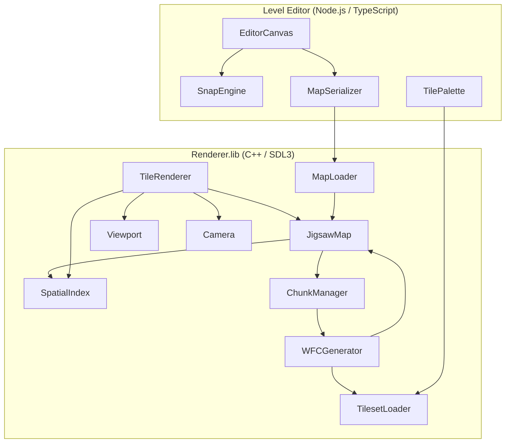

# Design Document: Jigsaw Tile Layout

## Overview

The Jigsaw Tile Layout system replaces the uniform-grid `MapData` structure with a `JigsawMap` that stores tiles at absolute pixel positions with variable dimensions. This enables tiles of different sizes to be placed edge-to-edge in a seamless jigsaw pattern, while maintaining efficient spatial queries for rendering and procedural generation.

The redesign affects four major subsystems:
1. **Map data structure** — `JigsawMap` replaces `MapData`, backed by a spatial index
2. **WFC generator** — Gap-queue algorithm replaces grid-based collapse
3. **Tile renderer** — Renders arbitrary-position tiles via spatial viewport queries
4. **Level editor** — Snap-to-edge placement for variable-size tiles

### Key Design Decisions

| Decision | Rationale |
|---|---|
| Grid-based spatial hash over R-tree | Simpler to implement in C++14, good enough for axis-aligned rectangles with predictable density. O(1) cell lookup vs O(log n) tree traversal. |
| Gap-queue WFC (priority queue of unfilled rectangles) | Naturally handles variable-size tiles without a fixed grid. Top-left-first ordering produces deterministic, visually coherent results. |
| Chunk-based infinite maps (NxN pixel regions) | Decouples generation from map size. Tiles spanning chunk borders are stored in all overlapping chunks. |
| Float positions (not int) | Allows sub-pixel precision from scale multiplication without rounding errors accumulating. |
| No backward compatibility | Old `MapData` grid format is fully replaced. Migration is not needed. |

## Architecture



### Data Flow

1. **Loading**: `MapLoader` reads JSON → constructs `JigsawMap` → builds `SpatialIndex` from placed tiles
2. **Rendering**: `TileRenderer` queries `SpatialIndex` with viewport rect → draws returned tiles in deterministic order
3. **Generation**: `WFCGenerator` takes a target region + tileset → fills using gap-queue → produces `JigsawMap`
4. **Infinite mode**: `ChunkManager` intercepts viewport queries → generates missing chunks via `WFCGenerator` → caches results
5. **Editor**: User selects tile → `SnapEngine` computes valid positions → placement writes to `JigsawMap` → `MapSerializer` exports JSON

## Components and Interfaces

### JigsawMap

Replaces `MapData`. Owns the collection of placed tiles and delegates spatial queries to its internal index.

```cpp
struct PlacedTile {
    std::string tile_id;  // references TileDef::id in tileset
    float x, y;           // absolute pixel position (top-left corner)
    float w, h;           // effective rendered size (pixels)
};

struct MapBoundary {
    float width_pixels;
    float height_pixels;
};

class JigsawMap {
public:
    // Configuration
    void SetTilesetId(const std::string& id);
    const std::string& GetTilesetId() const;
    void SetBoundary(const MapBoundary& boundary);  // finite mode
    void ClearBoundary();                            // infinite mode
    bool HasBoundary() const;
    const MapBoundary& GetBoundary() const;

    // Tile management
    bool AddTile(const PlacedTile& tile);    // returns false if overlaps
    bool RemoveTile(float x, float y);       // removes tile at position
    size_t GetTileCount() const;

    // Spatial queries
    std::vector<const PlacedTile*> QueryRect(float qx, float qy, float qw, float qh) const;
    const PlacedTile* QueryPoint(float px, float py) const;

    // Neighbor queries (for adjacency validation)
    std::vector<const PlacedTile*> GetEdgeNeighbors(const PlacedTile& tile) const;

    // Iteration
    const std::vector<PlacedTile>& GetAllTiles() const;

private:
    std::string m_tilesetId;
    MapBoundary m_boundary;
    bool m_hasBoundary = false;
    std::vector<PlacedTile> m_tiles;
    SpatialIndex m_index;
};
```

### SpatialIndex

Grid-based spatial hash. The world is divided into cells of configurable size (default 256px). Each cell stores indices into the tile vector.

```cpp
struct CellCoord {
    int cx, cy;  // cell grid coordinates
};

class SpatialIndex {
public:
    void SetCellSize(int size);  // default 256
    int GetCellSize() const;

    void Clear();
    void Insert(size_t tileIndex, const PlacedTile& tile);
    void Remove(size_t tileIndex, const PlacedTile& tile);
    void Rebuild(const std::vector<PlacedTile>& tiles);

    // Returns indices of tiles whose bounding rects intersect query rect
    std::vector<size_t> Query(float qx, float qy, float qw, float qh) const;

private:
    int m_cellSize = 256;
    std::unordered_map<int64_t, std::vector<size_t>> m_cells;  // packed (cx,cy) -> tile indices

    int64_t PackKey(int cx, int cy) const;
    CellCoord ToCellCoord(float px, float py) const;
};
```

### WFCGenerator (Redesigned)

Replaces the grid-based WFC with a gap-queue approach for variable-size tiles.

```cpp
struct Gap {
    float x, y, w, h;  // unfilled rectangular region
};

struct JigsawWFCParams {
    float target_width;             // target area width (pixels)
    float target_height;            // target area height (pixels)
    float origin_x, origin_y;      // top-left of target area
    unsigned int seed;              // 0 = non-deterministic
    const TilesetDef* tileset;      // must not be null
    float layer_scale;              // default 1.0 (applied during generation)
    const JigsawMap* context;       // existing tiles for border constraints (nullable)
};

struct JigsawWFCResult {
    WFCStatus status;
    JigsawMap map;                  // valid only if status == Success
};

class WFCGenerator {
public:
    // Legacy grid-based generation (kept for compatibility during transition)
    WFCResult Generate(const WFCParams& params);

    // New jigsaw generation
    JigsawWFCResult GenerateJigsaw(const JigsawWFCParams& params);

private:
    // Gap queue: priority queue sorted by position (top-left first)
    struct GapCompare {
        bool operator()(const Gap& a, const Gap& b) const;  // y first, then x
    };
    using GapQueue = std::priority_queue<Gap, std::vector<Gap>, GapCompare>;

    // Compute effective size for a tile def
    float EffectiveWidth(const TileDef& def, float sheetScale, float layerScale) const;
    float EffectiveHeight(const TileDef& def, float sheetScale, float layerScale) const;

    // Find tiles that fit a given gap considering adjacency constraints
    std::vector<size_t> GetCandidates(
        const Gap& gap,
        const TilesetDef& tileset,
        const JigsawMap& placed,
        float sheetScale, float layerScale,
        std::mt19937& rng) const;

    // Validate adjacency between a candidate tile and its neighbors
    bool ValidateAdjacency(
        const PlacedTile& candidate,
        const TileDef& candidateDef,
        const JigsawMap& placed,
        const TilesetDef& tileset) const;

    // After placing a tile, split the remaining gap into sub-gaps
    std::vector<Gap> SplitGap(const Gap& original, const PlacedTile& placed) const;

    // Backtracking state
    struct Snapshot {
        JigsawMap map;
        GapQueue gaps;
        size_t excludedTileIndex;  // tile to skip on retry
    };
};
```

### ChunkManager

Manages on-demand generation for infinite maps.

```cpp
struct ChunkCoord {
    int cx, cy;  // chunk grid coordinates
};

class ChunkManager {
public:
    void SetChunkSize(int pixels);   // default 512
    int GetChunkSize() const;

    // Generate chunks covering the given world-space rect
    void EnsureGenerated(float wx, float wy, float ww, float wh,
                         const TilesetDef& tileset, unsigned int baseSeed);

    // Query placed tiles in world-space rect (delegates to per-chunk JigsawMaps)
    std::vector<const PlacedTile*> QueryRect(float qx, float qy, float qw, float qh) const;

    bool IsChunkGenerated(int cx, int cy) const;

private:
    int m_chunkSize = 512;
    std::unordered_map<int64_t, JigsawMap> m_chunks;  // packed coord -> chunk data
    
    int64_t PackKey(int cx, int cy) const;
    ChunkCoord ToChunkCoord(float wx, float wy) const;
};
```

### TileRenderer (Modified)

New overload for rendering from a `JigsawMap`.

```cpp
class TileRenderer {
public:
    // Existing methods retained...

    // New: Render visible jigsaw tiles for a single layer.
    void RenderJigsawLayer(
        SDL_Renderer* renderer,
        const Tileset& tileset,
        const JigsawMap& map,
        const Viewport& viewport,
        const Camera& camera,
        const MapLayerConfig& config
    );

    void SetFallbackColor(Uint8 r, Uint8 g, Uint8 b);

private:
    Uint8 m_fallback_r = 255, m_fallback_g = 0, m_fallback_b = 255;
};
```

### MapLoader (Modified)

Extended to handle the new JSON format.

```cpp
class MapLoader {
public:
    // Legacy (kept for old format files)
    bool LoadMap(const std::string& filepath, MapData& out);
    std::string SerializeMap(const MapData& mapData) const;

    // New jigsaw format
    bool LoadJigsawMap(const std::string& filepath, JigsawMap& out);
    std::string SerializeJigsawMap(const JigsawMap& map) const;
    bool SaveJigsawMap(const std::string& filepath, const JigsawMap& map);

    // Validation
    struct UnresolvedJigsawTile { std::string id; float x; float y; };
    std::vector<UnresolvedJigsawTile> ValidateAgainstTileset(
        const JigsawMap& map, const TilesetDef& tileset) const;
};
```

### Level Editor (TypeScript)

The web editor gains a snap-to-edge placement system.

```typescript
// Core placement types
interface PlacedTile {
  tile_id: string;
  x: number;
  y: number;
  w: number;
  h: number;
}

interface SnapResult {
  x: number;
  y: number;
  valid: boolean;
  snappedEdge: 'top' | 'bottom' | 'left' | 'right' | null;
}

// Snap engine finds valid edge-aligned positions
class SnapEngine {
  constructor(private tiles: PlacedTile[], private threshold: number = 8) {}
  
  findSnapPosition(candidate: { w: number; h: number }, mouseX: number, mouseY: number): SnapResult;
  getValidPlacements(candidate: { w: number; h: number }): SnapResult[];
  wouldOverlap(candidate: PlacedTile): boolean;
}

// Map serializer handles JSON I/O
class MapSerializer {
  serialize(tiles: PlacedTile[], tilesetId: string, boundary?: { w: number; h: number }): string;
  deserialize(json: string): { tiles: PlacedTile[]; tilesetId: string; boundary?: { w: number; h: number } };
}
```

## Data Models

### Map JSON Format (New)

```json
{
  "format": "jigsaw",
  "tileset_id": "grassland",
  "boundary": {
    "width": 1920.0,
    "height": 1080.0
  },
  "tiles": [
    { "tile_id": "grass_01", "x": 0.0, "y": 0.0, "w": 64.0, "h": 64.0 },
    { "tile_id": "tree_01", "x": 64.0, "y": 0.0, "w": 128.0, "h": 128.0 },
    { "tile_id": "rock_small", "x": 0.0, "y": 64.0, "w": 64.0, "h": 32.0 }
  ]
}
```

- `format` — always `"jigsaw"` to distinguish from legacy grid maps
- `tileset_id` — references the tileset folder name
- `boundary` — optional; if absent, map is infinite
- `tiles` — flat array of placed tile records with absolute positions

### Effective Size Computation

```
effective_width  = source_rect.w * tile_scale * sheet_scale * layer_scale
effective_height = source_rect.h * tile_scale * sheet_scale * layer_scale
```

During WFC generation, `layer_scale` is always 1.0 — it only applies at render time.

### Spatial Index Cell Mapping

```
cell_x = floor(pixel_x / cell_size)
cell_y = floor(pixel_y / cell_size)
packed_key = (int64_t(cell_x) << 32) | (int64_t(cell_y) & 0xFFFFFFFF)
```

A tile spanning multiple cells is inserted into all cells it overlaps.

### Adjacency Detection

Two tiles are edge-adjacent when they share a non-zero-length collinear segment:

```
right_adjacent(A, B):  A.x + A.w == B.x  AND  overlap_y(A, B) > 0
bottom_adjacent(A, B): A.y + A.h == B.y  AND  overlap_x(A, B) > 0

overlap_y(A, B) = min(A.y + A.h, B.y + B.h) - max(A.y, B.y)
overlap_x(A, B) = min(A.x + A.w, B.x + B.w) - max(A.x, B.x)
```

A tile's right edge may be adjacent to multiple smaller tiles stacked vertically (multi-neighbor adjacency). Each pair is validated independently against the tileset's `AdjacencyRules`.

### Gap Queue Ordering

Gaps are sorted by position using a comparator:
1. Primary: smallest `y` first (topmost)
2. Secondary: smallest `x` first (leftmost)

This produces a left-to-right, top-to-bottom fill pattern.


## Correctness Properties

*A property is a characteristic or behavior that should hold true across all valid executions of a system — essentially, a formal statement about what the system should do. Properties serve as the bridge between human-readable specifications and machine-verifiable correctness guarantees.*

### Property 1: Spatial Query Correctness

*For any* set of placed tiles in a JigsawMap and *for any* query rectangle, the spatial index query SHALL return exactly the set of tiles whose bounding rectangles have a positive-area intersection with the query rectangle — no more, no fewer.

**Validates: Requirements 1.2, 1.3, 1.4**

### Property 2: Effective Size Computation

*For any* valid tile definition with source_rect dimensions (w, h), tile_scale, sheet_scale, and layer_scale values, the computed effective size SHALL equal (source_rect.w × tile_scale × sheet_scale × layer_scale, source_rect.h × tile_scale × sheet_scale × layer_scale), and all placed tiles in a WFC-generated map SHALL have width and height equal to their effective size with layer_scale = 1.0.

**Validates: Requirements 2.1, 2.2**

### Property 3: No-Overlap Invariant

*For any* JigsawMap, no two placed tiles SHALL have bounding rectangles with positive intersection area. Equivalently, for every pair of tiles (A, B) in the map: the overlap area `max(0, min(A.x+A.w, B.x+B.w) - max(A.x, B.x)) × max(0, min(A.y+A.h, B.y+B.h) - max(A.y, B.y))` SHALL equal zero.

**Validates: Requirements 4.3, 10.5**

### Property 4: Gap-Free Coverage for Finite Maps

*For any* successfully generated finite map (status == Success) with boundary (W, H), *for any* point (px, py) where 0 ≤ px < W and 0 ≤ py < H, there SHALL exist at least one placed tile T such that T.x ≤ px < T.x + T.w and T.y ≤ py < T.y + T.h.

**Validates: Requirements 4.4, 7.1, 7.3**

### Property 5: Edge-to-Edge Placement

*For any* two tiles A and B in a JigsawMap that are horizontally adjacent (A is immediately left of B), A.x + A.w SHALL equal B.x. *For any* two tiles A and B that are vertically adjacent (A is immediately above B), A.y + A.h SHALL equal B.y.

**Validates: Requirements 4.1, 4.2**

### Property 6: Adjacency Validation

*For any* pair of tiles in a successfully generated JigsawMap that share a non-zero-length boundary segment, the adjacency rules of both tiles SHALL be satisfied: if tile A's right edge contacts tile B's left edge, then B.tile_id must appear in A's `right` adjacency list (or A's right list is empty, meaning unconstrained), and A.tile_id must appear in B's `left` adjacency list (or B's left list is empty).

**Validates: Requirements 5.1, 5.2, 5.3, 5.4, 12.1, 12.2**

### Property 7: Deterministic Generation

*For any* valid JigsawWFCParams with seed > 0, calling GenerateJigsaw twice with identical parameters SHALL produce identical JigsawWFCResult instances (same status, same tiles in same order with same positions).

**Validates: Requirements 6.5**

### Property 8: Serialization Round-Trip

*For any* valid JigsawMap instance, serializing to JSON via MapLoader::SerializeJigsawMap and then deserializing via MapLoader::LoadJigsawMap SHALL produce a JigsawMap with identical tileset_id, identical boundary (if present), and an identical set of PlacedTile records (same tile_id, x, y, w, h values for each tile).

**Validates: Requirements 11.1, 11.2, 11.3**

### Property 9: Malformed Record Graceful Handling

*For any* JSON input containing N valid PlacedTile records and M malformed records (missing fields, wrong types, etc.), deserializing SHALL produce a JigsawMap containing exactly the N valid records, with the M malformed records skipped.

**Validates: Requirements 11.4**

### Property 10: Chunk Caching Idempotence

*For any* world-space query rectangle issued to ChunkManager, querying the same rectangle a second time SHALL return an identical set of PlacedTile records (same tiles, same positions, same order).

**Validates: Requirements 8.4**

### Property 11: Cross-Chunk Seamless Placement

*For any* two adjacent generated chunks, *for any* pair of tiles (one from each chunk) that share a non-zero-length boundary segment, the adjacency rules SHALL be satisfied, and there SHALL be no gap between the chunks (coverage is continuous across the boundary).

**Validates: Requirements 8.5, 8.6**

### Property 12: Snap Engine Validity

*For any* snap result produced by the SnapEngine given a candidate tile and existing tiles, the resulting position SHALL be edge-aligned with at least one existing neighbor AND SHALL NOT cause overlap with any existing tile.

**Validates: Requirements 10.2, 10.3**

### Property 13: Empty Adjacency Wildcard

*For any* tile definition with an empty adjacency list in a given direction, *for any* other tile placed adjacent in that direction, placement SHALL be permitted (no adjacency constraint violation).

**Validates: Requirements 12.3**

### Property 14: Deterministic Render Order

*For any* JigsawMap and viewport configuration, querying the spatial index for visible tiles SHALL return tiles in the same order on every invocation with identical inputs.

**Validates: Requirements 3.4**

## Error Handling

| Scenario | Component | Behavior |
|---|---|---|
| Tile placement would overlap existing tile | JigsawMap::AddTile | Returns `false`, map unchanged |
| WFC cannot fit any tile in a gap | WFCGenerator | Backtracks to previous placement; if exhausted, returns `WFCStatus::Contradiction` |
| Null tileset pointer in params | WFCGenerator | Returns `WFCStatus::InvalidInput` immediately |
| Malformed JSON tile record | MapLoader | Logs error via `SDL_Log`, skips record, continues loading remaining tiles |
| JSON parse failure (syntax error) | MapLoader | Returns `false`, output JigsawMap is empty |
| Tileset tile_id not found during render | TileRenderer | Renders fallback magenta rectangle at tile's position/size |
| Infinite generation timeout | ChunkManager | Caps generation attempts per frame; defers remaining to next frame |
| Invalid boundary (zero or negative dimensions) | JigsawMap::SetBoundary | Ignored; map remains in previous mode |
| Tile position contains NaN/Inf | MapLoader (deserialization) | Skips record (treated as malformed) |
| Chunk generation produces contradiction | ChunkManager | Retries with adjusted seed; if persistent, leaves chunk empty and logs warning |

### Floating-Point Considerations

Edge-to-edge alignment relies on exact float equality. Since effective sizes are computed as products of integers (source_rect pixels) and float scales, precision is maintained by:
- Storing scales as `float` (sufficient for 4-5 significant digits)
- Positions are always computed from a previous tile's position + size (no cumulative drift)
- No division in placement math — only multiplication and addition
- Comparison tolerance of 0.001f used for adjacency detection to handle rare rounding from scale multiplication

## Testing Strategy

### Property-Based Testing (PBT)

This feature is well-suited to property-based testing because the core logic involves pure data transformations (spatial indexing, placement computation, serialization) with clearly definable universal invariants.

**Library**: [RapidCheck](https://github.com/emil-e/rapidcheck) (C++ property-based testing library, compatible with C++14)

**Configuration**: Minimum 100 iterations per property test.

**Tag format**: Each test will be tagged with:
```
// Feature: jigsaw-tile-layout, Property N: <property_text>
```

**PBT priorities** (properties most valuable to test via generation):
1. Property 1 (spatial query correctness) — brute-force oracle comparison
2. Property 3 (no-overlap invariant) — exhaustive pair check on generated maps
3. Property 4 (gap-free coverage) — random point sampling
4. Property 7 (deterministic generation) — run-twice comparison
5. Property 8 (serialization round-trip) — random map generation

### Unit Tests (Example-Based)

Unit tests cover specific examples and edge cases:
- Empty map queries return empty results
- Single-tile map queries
- Boundary set/clear toggle
- Effective size with scale = 1.0 (identity)
- WFC with seed = 0 produces varying output
- Contradiction detection with impossible tileset
- Malformed JSON with specific bad fields (missing tile_id, non-numeric x, etc.)
- Snap engine with no existing tiles (free placement)
- Overflow tiles at finite boundary edges

### Integration Tests

- Full render pipeline: load tileset + generate map + render to offscreen texture + verify pixel coverage
- ChunkManager: viewport movement triggers chunk generation
- Level editor serialization: editor save → C++ load → verify identical map
- WFC with real tilesets (grassland, forest) verifying visual correctness

### Test Organization

```
tests/
  test_spatial_index.cpp       — Property 1, unit tests for SpatialIndex
  test_jigsaw_map.cpp          — Properties 3, 5; unit tests for JigsawMap
  test_wfc_jigsaw.cpp          — Properties 4, 6, 7; WFC generation tests
  test_map_serialization.cpp   — Properties 8, 9; JSON round-trip tests
  test_chunk_manager.cpp       — Properties 10, 11; chunk caching tests
  test_effective_size.cpp      — Property 2; size computation tests
  test_snap_engine.cpp         — Property 12; TypeScript snap logic (if tested via C++ port)
  test_adjacency.cpp           — Properties 6, 13; adjacency detection and validation
```
