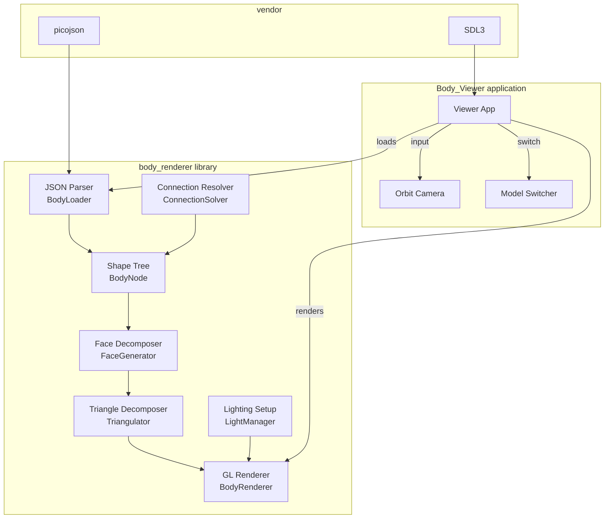

# Design Document: OpenGL Body Renderer

## Overview

The OpenGL Body Renderer feature adds a static library (`body_renderer/`) and a viewer application (`Body_Viewer`) to the Particluar project. The library provides:

- A JSON-based format for defining hierarchical 3D shape trees composed of 6 primitive types
- A connection system for attaching child shapes to parent shapes via faces, edges, or vertices
- A face decomposition pipeline that converts primitives into polygonal faces, then into triangles
- OpenGL 2 immediate-mode rendering with flat shading and Phong lighting (up to 8 point lights)

The viewer application loads body JSON files from a directory and provides interactive rotation (WASD) and model switching (arrow keys).

**Design Rationale:** OpenGL 2 immediate mode (`glBegin`/`glEnd`) is chosen deliberately for simplicity and portability — this is a tool/viewer for examining shapes, not a production renderer. SDL3 provides window management, event handling, and the OpenGL context. The library mirrors the existing `renderer/` static library structure.

---

## Architecture



**Data flow:** JSON file → parse into `BodyNode` tree → resolve connections (compute transforms) → generate faces per primitive → triangulate faces → submit triangles to OpenGL with normals and lighting.

---

## Components and Interfaces

### 1. BodyLoader (JSON Parsing)

Parses a body JSON file into an in-memory `BodyNode` tree.

```cpp
// body_renderer/include/BodyLoader.h
#pragma once
#include <string>
#include <vector>

struct BodyNode;

struct LoadResult {
    bool success;
    std::string error;
    BodyNode* root; // nullptr on failure
};

class BodyLoader {
public:
    LoadResult LoadFromFile(const std::string& filepath);
    LoadResult LoadFromString(const std::string& json);
    std::string Serialize(const BodyNode* root) const;

private:
    bool ParseNode(const void* json_obj, BodyNode* out, std::string& error);
};
```

### 2. Shape Primitives and BodyNode

```cpp
// body_renderer/include/BodyTypes.h
#pragma once
#include <string>
#include <vector>
#include <array>

enum class ShapeType {
    Box,
    Cone,
    Cylinder,
    Sphere,
    Torus,
    Frustum
};

struct Vec3 {
    float x, y, z;
};

struct Mat4 {
    float m[16]; // column-major 4x4
};

// Shape parameters — union-like via variant fields per type
struct ShapeParams {
    ShapeType type;

    // Box: width, height, depth
    float width, height, depth;

    // Cone: radius, height, segments
    float radius;
    // float height; (shared)
    int segments;

    // Cylinder: radius, height, segments
    // (shared fields above)

    // Sphere: radius, lat_segments, lon_segments
    int lat_segments, lon_segments;

    // Torus: major_radius, minor_radius, ring_segments, side_segments
    float major_radius, minor_radius;
    int ring_segments, side_segments;

    // Frustum: top_radius, bottom_radius, height, segments
    float top_radius, bottom_radius;
    // float height; (shared)
    // int segments; (shared)
};

enum class ConnectionType {
    Face_Connection,
    Edge_Connection,
    Point_Connection
};

struct Connection {
    ConnectionType type;
    int parent_face_index;    // which face/edge/point on parent
    int child_face_index;     // which face/edge/point on child (for alignment)
    float offset_u, offset_v; // parametric offset on the face/edge
    float rotation;           // rotation around connection normal (degrees)
};

struct BodyNode {
    std::string name;
    ShapeParams shape;
    Connection connection;    // how this node attaches to parent (ignored for root)
    Mat4 local_transform;     // computed from connection
    std::vector<BodyNode> children;
};
```

### 3. FaceGenerator (Face Decomposition)

Generates polygonal faces from primitive parameters.

```cpp
// body_renderer/include/FaceGenerator.h
#pragma once
#include "BodyTypes.h"
#include <vector>

struct Face {
    std::vector<Vec3> vertices; // ordered CCW when viewed from outside
    Vec3 normal;                // outward-pointing unit normal
};

class FaceGenerator {
public:
    std::vector<Face> Generate(const ShapeParams& shape) const;

private:
    std::vector<Face> GenerateBox(const ShapeParams& s) const;
    std::vector<Face> GenerateCone(const ShapeParams& s) const;
    std::vector<Face> GenerateCylinder(const ShapeParams& s) const;
    std::vector<Face> GenerateSphere(const ShapeParams& s) const;
    std::vector<Face> GenerateTorus(const ShapeParams& s) const;
    std::vector<Face> GenerateFrustum(const ShapeParams& s) const;
};
```

**Face counts per primitive:**
| Shape | Face count |
|-------|-----------|
| Box | 6 |
| Cone | segments + 1 (sides + base) |
| Cylinder | segments + 2 (sides + top + bottom) |
| Sphere | lat_segments × lon_segments |
| Torus | ring_segments × side_segments |
| Frustum | segments + 2 (sides + top + bottom) |

### 4. Triangulator

Decomposes convex polygonal faces into triangles using a fan decomposition.

```cpp
// body_renderer/include/Triangulator.h
#pragma once
#include "FaceGenerator.h"

struct Triangle {
    Vec3 v0, v1, v2;
    Vec3 normal; // flat-shading: same as face normal
};

class Triangulator {
public:
    // Fan decomposition: for N-vertex face, produces N-2 triangles
    std::vector<Triangle> Triangulate(const std::vector<Face>& faces) const;
    std::vector<Triangle> TriangulateFace(const Face& face) const;
};
```

### 5. ConnectionSolver

Computes the local transform for each node based on its connection spec.

```cpp
// body_renderer/include/ConnectionSolver.h
#pragma once
#include "BodyTypes.h"
#include "FaceGenerator.h"

class ConnectionSolver {
public:
    // Resolves all transforms in the tree (recursive, depth-first)
    void ResolveTree(BodyNode* root) const;

    // Compute transform for a single connection
    Mat4 ComputeTransform(
        const Connection& conn,
        const std::vector<Face>& parent_faces,
        const std::vector<Face>& child_faces
    ) const;

private:
    Mat4 ComputeFaceConnection(const Connection& conn, const Face& parent_face, const Face& child_face) const;
    Mat4 ComputeEdgeConnection(const Connection& conn, const Face& parent_face, const Face& child_face) const;
    Mat4 ComputePointConnection(const Connection& conn, const std::vector<Face>& parent_faces) const;
};
```

### 6. BodyRenderer (OpenGL Submission)

Renders the fully resolved body tree using OpenGL 2 immediate mode.

```cpp
// body_renderer/include/BodyRenderer.h
#pragma once
#include "BodyTypes.h"
#include "FaceGenerator.h"
#include "Triangulator.h"

struct PointLight {
    Vec3 position;
    Vec3 diffuse;
    Vec3 specular;
    float constant_atten, linear_atten, quadratic_atten;
};

struct RenderParams {
    Vec3 ambient;
    std::vector<PointLight> lights; // max 8
    float shininess;
    Vec3 model_color;
};

class BodyRenderer {
public:
    void Render(const BodyNode* root, const RenderParams& params) const;

private:
    void RenderNode(const BodyNode* node, const Mat4& parent_world) const;
    void SubmitTriangles(const std::vector<Triangle>& tris, const Mat4& world) const;
    void SetupLighting(const RenderParams& params) const;
};
```

### 7. LightManager

Manages OpenGL fixed-function light state.

```cpp
// body_renderer/include/LightManager.h
#pragma once
#include "BodyTypes.h"
#include <vector>

struct PointLight;

class LightManager {
public:
    void Apply(const std::vector<PointLight>& lights, const Vec3& ambient) const;
    void Disable() const;
};
```

### 8. ModelSwitcher (Viewer utility)

Manages cycling through body files in a directory.

```cpp
// body_renderer/include/ModelSwitcher.h
#pragma once
#include <string>
#include <vector>

class ModelSwitcher {
public:
    bool LoadDirectory(const std::string& dir_path);
    int GetCount() const;
    int GetCurrentIndex() const;
    std::string GetCurrentPath() const;

    void Next();
    void Previous();

private:
    std::vector<std::string> m_paths;
    int m_current_index = 0;
};
```

---

## Data Models

### Body JSON Format

```json
{
  "name": "RobotArm",
  "shape": {
    "type": "Cylinder",
    "radius": 0.5,
    "height": 3.0,
    "segments": 16
  },
  "children": [
    {
      "name": "Shoulder",
      "shape": {
        "type": "Sphere",
        "radius": 0.6,
        "lat_segments": 12,
        "lon_segments": 16
      },
      "connection": {
        "type": "Face_Connection",
        "parent_face": 0,
        "child_face": 0,
        "offset_u": 0.5,
        "offset_v": 0.5,
        "rotation": 0.0
      },
      "children": []
    }
  ]
}
```

### Shape Parameter Schemas

| Shape | Required Fields |
|-------|----------------|
| Box | `width`, `height`, `depth` |
| Cone | `radius`, `height`, `segments` |
| Cylinder | `radius`, `height`, `segments` |
| Sphere | `radius`, `lat_segments`, `lon_segments` |
| Torus | `major_radius`, `minor_radius`, `ring_segments`, `side_segments` |
| Frustum | `top_radius`, `bottom_radius`, `height`, `segments` |

### Connection Schema

| Field | Type | Description |
|-------|------|-------------|
| `type` | string | `"Face_Connection"`, `"Edge_Connection"`, `"Point_Connection"` |
| `parent_face` | int | Index of the face/edge/point on the parent shape |
| `child_face` | int | Index of the face/edge/point on the child shape for alignment |
| `offset_u` | float | Parametric U offset (0.0–1.0) on the parent element |
| `offset_v` | float | Parametric V offset (0.0–1.0) on the parent element |
| `rotation` | float | Rotation in degrees around the connection normal |

### Mat4 Convention

Column-major, OpenGL-compatible layout. Identity is:
```
1 0 0 0
0 1 0 0
0 0 1 0
0 0 0 1
```
Translation in elements [12], [13], [14].

---

## Correctness Properties

*A property is a characteristic or behavior that should hold true across all valid executions of a system — essentially, a formal statement about what the system should do. Properties serve as the bridge between human-readable specifications and machine-verifiable correctness guarantees.*

### Property 1: JSON Round-Trip Preservation

*For any* valid `BodyNode` tree, serializing it to JSON and parsing it back SHALL produce a structurally equivalent tree (same shape types, same parameters within float epsilon, same connection specs, same child counts).

**Validates: Requirements 1.1, 7.1**

### Property 2: Invalid JSON Graceful Rejection

*For any* malformed JSON input (missing required fields, wrong types, invalid enum values, truncated data), the parser SHALL return `success == false` with a non-empty error message and `root == nullptr`, without crashing or throwing unhandled exceptions.

**Validates: Requirements 1.2**

### Property 3: Face Count Invariant

*For any* valid `ShapeParams`, the number of faces returned by `FaceGenerator::Generate()` SHALL equal the mathematical formula for that shape type (e.g., Box = 6, Cone = segments + 1, Cylinder = segments + 2, Sphere = lat × lon, Torus = rings × sides, Frustum = segments + 2).

**Validates: Requirements 2.1**

### Property 4: Triangle Decomposition Validity

*For any* list of faces produced by the face generator, triangulation SHALL produce exactly `sum(vertices_per_face - 2)` triangles, each with non-zero area and a normal vector consistent in direction with the source face normal.

**Validates: Requirements 2.2**

### Property 5: Face Normal Unit-Length and Perpendicularity

*For any* face generated by `FaceGenerator`, the face normal SHALL have magnitude 1.0 (±ε) and SHALL be perpendicular to every edge vector of that face (dot product ≈ 0.0 ±ε).

**Validates: Requirements 6.1**

### Property 6: Connection Transform Geometric Correctness

*For any* valid parent shape and `Face_Connection`, the child's origin (after transform application) SHALL lie on the plane defined by the specified parent face. For `Edge_Connection`, the child origin SHALL lie on the specified edge line segment. For `Point_Connection`, the child origin SHALL coincide with the specified vertex.

**Validates: Requirements 3.1**

### Property 7: Nested Transform Accumulation

*For any* shape tree of depth N, the world-space position of a leaf node's vertices SHALL equal the sequential multiplication of all ancestor transforms applied to the leaf's local vertices. Inserting an identity transform at any level in the chain SHALL not alter the final world-space positions.

**Validates: Requirements 3.2**

### Property 8: Model Index Wraparound

*For any* model list of size N (N ≥ 1) and any sequence of Next/Previous calls, the current index SHALL always remain in the range [0, N). Calling Next from index N-1 SHALL wrap to 0; calling Previous from index 0 SHALL wrap to N-1.

**Validates: Requirements 5.3**

---

## Error Handling

| Scenario | Behavior |
|----------|----------|
| JSON file not found | `LoadResult.success = false`, error = "File not found: <path>" |
| JSON parse error (syntax) | `LoadResult.success = false`, error from picojson |
| Missing required shape field | `LoadResult.success = false`, error = "Missing field '<name>' in shape '<node_name>'" |
| Invalid shape type string | `LoadResult.success = false`, error = "Unknown shape type: '<value>'" |
| Invalid connection type | `LoadResult.success = false`, error = "Unknown connection type: '<value>'" |
| Face index out of range | `LoadResult.success = false`, error = "parent_face index <N> out of range for shape with <M> faces" |
| Segments < 3 | `LoadResult.success = false`, error = "segments must be >= 3" |
| Radius/dimension <= 0 | `LoadResult.success = false`, error = "'<field>' must be positive" |
| OpenGL context not available | `BodyRenderer::Render()` logs error via `SDL_Log` and returns without drawing |
| More than 8 lights | Only first 8 are applied; warning logged via `SDL_Log` |
| Empty model directory | `ModelSwitcher::LoadDirectory()` returns false |

All errors are non-fatal — the library never calls `exit()` or throws. The caller handles the error state.

---

## Testing Strategy

### Property-Based Tests (RapidCheck)

The project has `vendor/rapidcheck/` available. Each correctness property above will be implemented as a RapidCheck property test with a minimum of 100 iterations.

**Library:** RapidCheck (already in `vendor/rapidcheck/`)

**Configuration:**
- Minimum 100 iterations per property
- Custom generators for `ShapeParams`, `BodyNode` trees, `Connection` specs
- Tests compiled into a separate `body_renderer_tests` executable

**Tag format for each test:**
```cpp
// Feature: opengl-body-renderer, Property 1: JSON Round-Trip Preservation
RC_GTEST_PROP(BodyLoader, JsonRoundTrip, ()) { ... }
```

### Unit Tests (Example-Based)

- Specific known shapes (unit cube = 6 faces, 12 triangles)
- Specific connection scenarios (sphere on top of box via top face)
- Edge cases: minimum segment counts, degenerate zero-dimension shapes
- Lighting setup: verify GL state after applying 0, 1, 4, 8 lights

### Integration Tests

- Full pipeline: load a known JSON file → render to an offscreen OpenGL context → verify no GL errors
- Viewer startup: load a directory with 3 files, verify model switching cycles correctly
- Phong lighting: render with lights enabled, verify GL_LIGHT0..GL_LIGHT7 state

### Build Integration

A new `body_renderer_tests.vcxproj` project links against `body_renderer.lib` and `vendor/rapidcheck`. It runs as a post-build step or manually via the test executable.
